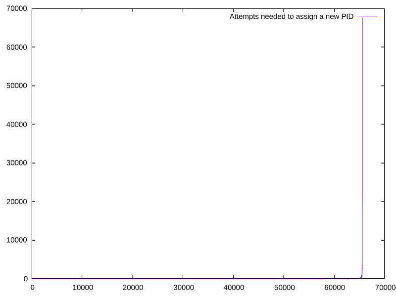
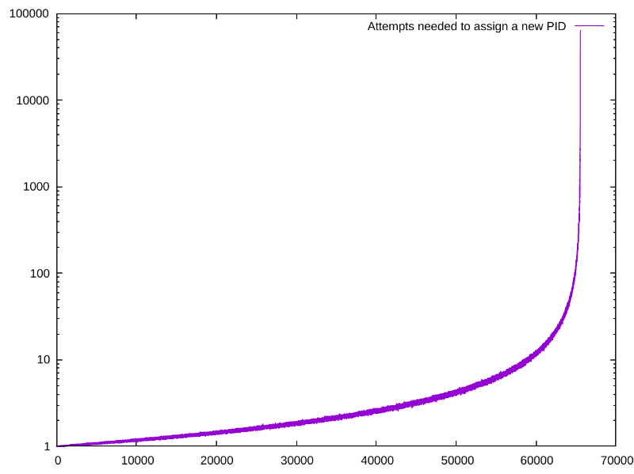

# random-pid-simulator

Simulates a hypothetical Unix system that assigns process IDs (PIDs) randomly
(as in OpenBSD) instead of sequentially (as in Linux and most others). Features
horribly scuffed use of [Debug](https://doc.rust-lang.org/std/fmt/trait.Debug.html)!

Answers the question "how likely is it that a random-PID system will need to
reroll a new PID?"

The answer? No. Not at all, not until you've exhausted almost all (99%+) of your
PID space.



Was that impossible to read? Here's the same chart with a logarithmic y-axis.



Yeah, it doesn't matter at all.

## Generating your own plots

```
cargo r --release -- --pid-space $((2 ** 16 - 2)) --simulations 1000 | \
tr ',' '\n' | tr -d ' []' | \
gnuplot -p -e '
    set logscale y; 
    plot "/dev/stdin" using 0:1 with lines title "Attempts needed to assign a new PID";
'
```
